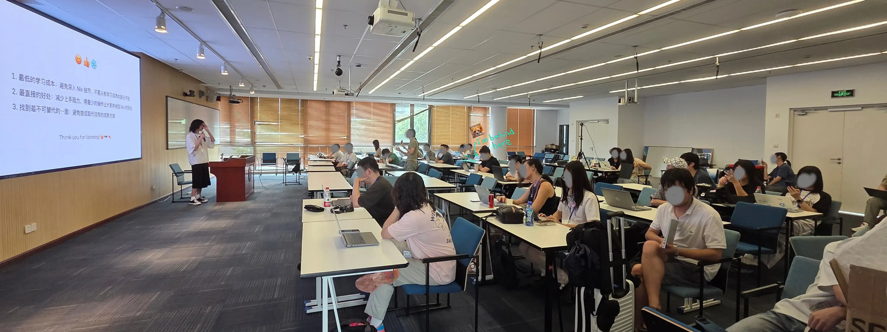
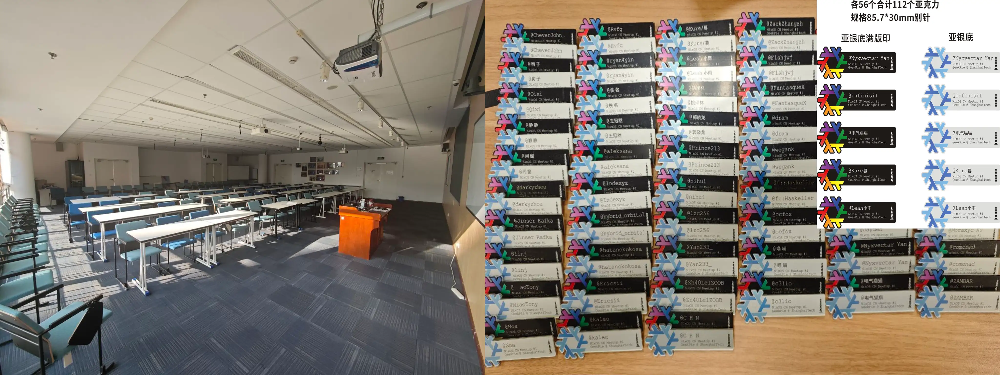
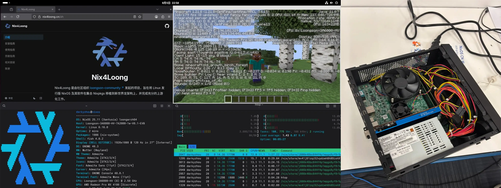
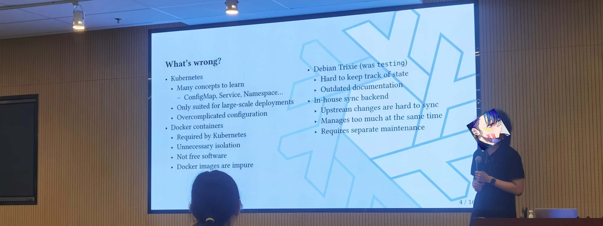
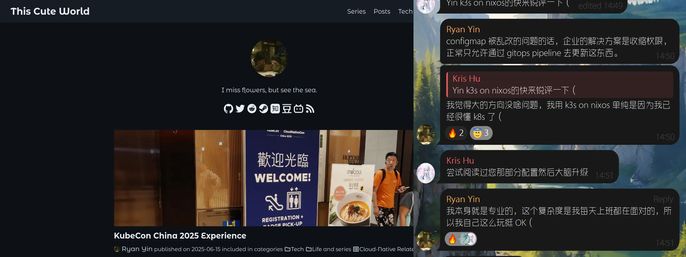
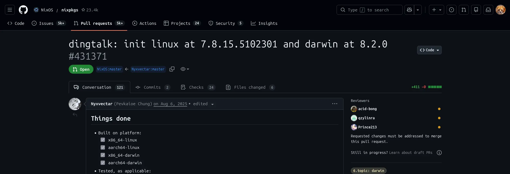
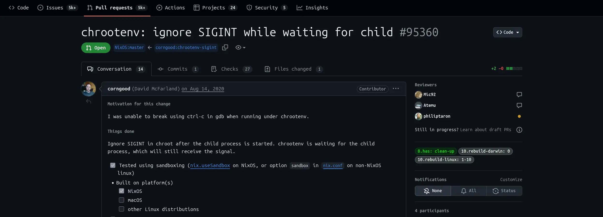
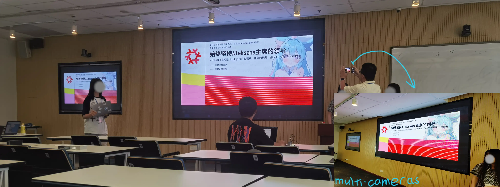

:::note[When Editing]
The content was **LLM corrected**, for **structures** and **syntax**, which
fixed plenty errors of my English. Btw, I'm planning there may
have a [IELTS](https://ielts.org) examination in the future for myself.
This content is my old article, I originally planned to just copy it over,
but ended up **rewriting** almost the **entire** essay, edited on **Feb 12, 2026**.
:::

:::tip[Preface]
`GMT+8` This [event](https://prince213.top/events/nixos-cn-meetup-1/) took place 
on August **9th, 10th** in [Shanghai, China](https://en.wikipedia.org/wiki/Shanghai), 
and was hosted by [@prince213](https://prince213.top). It is the **first** conference in China 
dedicated to `Nix`. As I didn't take many 
photos at the time, the images used in this article may have been taken by 
other attendees. I will provide a list of photographers in the footnotes.
**e.g.** the first photo below was taken by [@nihui](https://t.me/nihui_szyl).
:::

---

# First Encounter

Within **two days**, I spoke **less than 10 sentences** face to face.



As someone with severe social **anxiety**, I’ve always preferred expressing 
myself online. I dare not say a single word to people I’m not close to. 
I **didn’t even know** what I was afraid of. watching everyone chat freely, I want 
to join in too, but I just can’t bring myself to speak. _In early August_, 
I saw the promotion for [the Conference](https://nixos.party/) and joined their 
[channel](https://t.me/nixcnmeetup), 
but I froze for a moment when I saw the sign up form. It's, uh, **scary**.

Should I go **or not**? I couldn’t figure out why I hesitated. 

- If I don’t speak 
up now, eventually, **I’ll have to.** 
- If I can’t learn to interact with people 
now, in the future, **interactions always fail**. 
- Or, was it because I lacked confidence in my _looks_? 

Well, I don't care about my appearance, nobody can decide it, _just keep tidy_ 
then it is fine. I have to show my face to people anyway, can someone hide 
forever? High school doesn’t leave me much time to gain social experience, 
although hesitated for a long time, I think, _just go for it_. 
After all, I’m still a student, it’s okay to embarrass myself a little. 
**I might as well use up all the awkward moments I’d have in the future 
ahead of time**, and, :spoiler[**it’s even(?) a gain**].

I told my parents about it, and to my surprise, they agreed **right away**!
and were unusually excited. Maybe it’s because I’m not like other high 
school students who stay home all day? I’m not sure. Few of us play games 
or scroll through short videos at home, we’re just a group of students 
who balance study and activities. In recent years, the local government 
leveled several hills and built 
[Lishui Airport](https://parametric-architecture.com/mad-lishui-airport-china/), 
even our mountainous area now has flights. It was the perfect 
chance to take a plane for the first time.

:::tip[I don't know what to say about it, but:]
Some people might laugh at what I was going to say in this note block, 
I can understand, but **I’m not going to lie** and not afraid of being laughed at. These are all experiences 
I’ve never had before, that was it. Looking back now, 
this trip gave me so many **firsts**. 

- Have a flight, the time I was with `Airbus A320`[^1] `MU6986` **;**
- Leaving [Zhejiang Province](https://en.wikipedia.org/wiki/Zhejiang)[^2]
(Like **California** in the U.S.) **;**
- Take a high speed train and a subway rides **;**
- Participating in a social conference individually **;**
- And many many others **...**
:::

[^1]: You know, as an aerospace enthusiast, [DCS](https://www.digitalcombatsimulator.com/en/) 
player, I only took my first flight today **...**
[^2]: Strictly speaking, when we [visit relatives](https://www.chineselearning.com/chinese-culture/why-do-people-visit-relatives-during-chinese-new-year), 
geographical factors mean we technically cross the provincial border a
tiny bit. But we've _never_ done it with a plan.

When I arrived in Shanghai, I was struck by how **huge** and **crowded** 
the city was. The crowds weren’t a big problem, but the prices 
were shockingly high.

---

# Off We Go!
## Take the Plane


_(Above: Reached the airport, below: landed in_ 
_[PVG, Shanghai](https://www.shanghai-airport.com/))_

Too bad it's a night flight, nothing is visible.

## Reach the Venue


_(Left is the photo of the venue, taken by [@prince213](https://prince213.top)_ 
_on **August, 6th**. Right are tags of attendees)_

Volunteers had already arrived early that day to set up the venue. 
Since it was the first of its kind for `Nix` in China, objectively speaking, 
attendance wasn't huge around _60_ people judging by the name tags,
but it was enough to scare me half to death. Well, since I'm here, 
I'd better get some experience out of it, and better **don't complain** again.

Some of the machines on display were quite special. For instance, 
there was a [_**Loongson**_](https://www.loongson.cn/product/show?id=26)[^3]
`3A6000` capable of running `NixOS` and even 
**playing Minecraft**, which I hadn't expected at all. And, amidst **this 
linux con**, **I brought a Windows laptop**. Uh... maybe if I just keep 
`Tailscale` SSHing into my workstation, nobody will notice. _Em mm, 
I hope._ :spoiler[Fine, I got caught later.]

[^3]: [_**Loongson**_](https://en.wikipedia.org/wiki/Loongson) is a leading _Chinese 
brand_ of homegrown general purpose CPUs. It has built the independent `LoongArch`
instruction set architecture. Its processors serve PCs, servers and embedded systems.
Detail can be found in [here](https://www.loongson.cn/EN).



:::tip[About NixOS Compatibility]
If even the `Loongson` can run it smoothly, compatibility shouldn't be an 
issue. But my `NixOS` setup with an `R9 9950x` and `7200MHz` RAM is unstable, 
throwing tons of `Corrected Errors` in `L1` cache. I've tried many to tackle 
it, didn't work. I'm not sure if it's a hardware problem because... actually
the instability only happens on `NixOS` :spoiler[LMAO]. Really reproducible, bro.
:::

---

# Ownership Moved to Main
It's Rust Calling. ~~Oops, wrong script.~~
## Routines and Arrangements
### Day 1
1.  **09:30** On-site check-in and registration
2.  **10:30** **@Zh40Le1ZOOB** User program config management with wrappers
3.  **10:45** **@NoaVirellia** Promote `Nix` adoption within your company
4.  **11:05** [**@Aleksana**](https://aleksana.moe/) Personal review focus areas and preferences
5.  **11:30** [**@Aleksana**](https://aleksana.moe/) Implementation deep dive: `Nix`/`Nixpkgs`/`NixOS`
6.  **12:15** Project demo, lunch break and networking
7.  **14:20** **@Jinser** Evangelize `Nix` effectively in the workplace
8.  **14:40** [**@prince213**](https://prince213.top) `NixOS` mirror hosting **without `Kubernetes`**
9.  **15:15** **@Leah** `Nixpkgs` packaging from personal to upstream
10. **15:50** **@linj** Panel: `Nix` **commercialization** in China
11. **16:15** Afternoon coffee break and discussion
12. **16:40** **@wegank** `Nix` adaptation and support for **loongarch**
13. **17:15** [**@prince213**](https://prince213.top) Closing speech and summary of Day 1


### Day 2
1.  **09:30** Morning check-in and preparation
2.  **10:30** [**@prince213**](https://prince213.top) Opening address for Day 2
3.  **10:45** [**@prince213**](https://prince213.top), **@NoaVirellia** Workshop: `Nix` basics for beginners
4.  **11:50** Tech demo, lunch and casual networking
5.  **14:30** [**@ryan4yin**](https://thiscute.world/en/) My journey with the `Nix` community
6.  **15:35** Mid-afternoon coffee break and relaxation
7.  **15:55** [**@dram**](https://dram.page) Introduction and overview of nix-dram
8.  **16:05** **@linj** Declarative `Emacs` config in `Nixpkgs`
9.  **16:15** **@HaonanChen** `Nix` usage in scientific computing
10. **16:35** **@linj** Tips for contributing to `Nixpkgs`
11. **17:00** **@Cryolitia** `CJK` support analysis: a **Steam** case study

## Time for ~~Meeting?~~ Having Classes

After that, I just listened along as usual. Let me go ahead and share my 
current **personal** thoughts on [Nix](https://nixos.org/), 
[Nixpkgs](https://github.com/NixOS/nixpkgs) and its
[Community](https://nixos.org/community.html).
As for the various knowledge and information provided during the agenda, 
you can find it all [here](https://nixos.party/).

Nix is a great fit for scientific research work[^4] and people 
who love tinkering, esp. those into ricing who are still Linux hopping 
(_no offense intended_). Rollbacks are incredibly convenient, and its strong
declarative design makes **syncing environments across multiple machines** 
really **straightforward**. This is a godsend for people with multiple computers,
like myself, for instance.

$$
\left( \mathbf{PkgMgr} \neq \mathbf{Sys} \land \mathbf{Sys} 
\neq \mathbf{Lang} \land \mathbf{Lang} \neq \mathbf{PkgMgr} 
\right) \equiv \mathbb{T}  \\[0.8em]
\forall \mathbf{Nix} \implies \mathbf{PkgMgr} \overset{\text{Nix 
Trinity}}{\Longleftrightarrow } \mathbf{Sys} \overset{\text{Nix
Trinity}}{\Longleftrightarrow } \mathbf{Lang}
$$

[^4]: [Haonan Chen](https://chn.moe) is one of the attendees who has 
dabbled in this field. I find him to be a fascinating character really.

That said, it doesn’t seem to suit me all that well. First, there’s the 
**stability issue** I mentioned earlier. Second, `Nix` feels like it goes **beyond
my actual needs**. `Kubernetes` and `Podman` are more than enough for what I do.
Just run the codes, **by server side**. ure, `Nix` has many advantages 
compared to `Kubernetes` as well. So there are also some people 
who prefer `Nix`, like the organizer of this event, [**@prince213**](https://prince213.top).



Of course, there are also some special cases, like
[**@ryan4yin**](https://thiscute.world/en/),
the **author** of 
[**_The Nix & Flakes Book_**](https://nixos-and-flakes.thiscute.world/).


:::important[Translation in `YAML`]
```csv collapse={2-15}
messages:
  - id: "1"
    speaker: "Kris Hu"
    content: "Come give a hot take on Yin's k3s on NixOS setup."
  - id: "2"
    speaker: "Ryan Yin"
    content: "Regarding the issue of configmaps being arbitrarily modified, enterprise solutions involve tightening permissions—typically only allowing updates via GitOps pipelines."
  - id: "3"
    speaker: "Ryan Yin"
    content: "I think the overall direction is fine. I use k3s on NixOS simply because I already know k8s really well."
  - id: "4"
    speaker: "Kris Hu"
    content: "I tried reading that part of your config, it felt like a brain upgrade."
  - id: "5"
    speaker: "Ryan Yin"
    content: "I'm a professional myself. This is the level of complexity I deal with at work every day, so it's totally fine for me to use this setup personally."
```
:::

From community side,
contributors to the Nix community come from all over the world.
Due to inconsistent review quality, some packages with strong
**regional** characteristics may not be well understood by others.
As a result, some **poorly** packaged versions can be merged into
[**the main branch**](https://github.com/NixOS/nixpkgs) 
relatively quickly, though the situation has improved somewhat recently.



In addition, many issues **are not caused by** packagers, and such 
problems are particularly prominent with close source software. 
The `dingtalk` package shown above is a pull request I previously 
submitted to nixpkgs (also **first** one). Apart from the issues I pointed out in 
my comments, there are also _various other small and large 
problems_ with `dingtalk`. I tried to report these issues to [_**Alibaba**_](https://finance.yahoo.com/quote/BABA/)
, but either the relevant features were **directly removed**,
:spoiler[**Wow, great job "fixing" the bug by just removing the feature 🫰🏻**]
or there was **no response at all**.

```nix collapse={5-15}
meta = {
    description = "Enterprise-level communication platform developed by Alibaba";
    homepage = "https://www.dingtalk.com";
    license = lib.licenses.unfree;
    platforms = [
        "x86_64-linux"
        "aarch64-linux"
        "x86_64-darwin"
        "aarch64-darwin"
    ];
    sourceProvenance = with lib.sourceTypes; [ binaryNativeCode ];
    maintainers = with lib.maintainers; [
        svecco
        prince213
    ];
    mainProgram = "dingtalk";
};
```

:::note[Regarding My Packaging of DingTalk]
Nowadays, it is extremely **difficult** to reach a human 
customer service representative at _**Alibaba**_ opening the 
customer service interface only leads to an unhelpful **AI 
chatbot**. These are problems I cannot resolve on my own, 
and many other **close source** software packages suffer 
from the same issue, such as `ToDesk`.
:::


On a side note, `nixpkgs` is the world’s **largest monolithic** software package 
repository, with more than **400,000** pull requests totally. This has made reviews 
extremely tough. Even though there are far more active maintainers now 
than when I am using [**Gentoo**](https://gentoo.org/), 
it’s still common for issues to sit unreviewed or unmerged for quarters.

 
_(Above shows a randomly selected PR that has been ready for merge for a "while")_.

To ease the problem, nixpkgs has added a bot that lets maintainers 
merge their own pull requests. But using the bot **requires you to be a 
maintainer first**, which creates a **"chicken or egg"** problem unless you 
actively reach out to people. I hope the Nix community will come up 
with better solutions down the line.

I’m still optimistic about Nix’s future. In a time when systems
and distros are thriving everywhere, it’s definitely **a trend** to watch.
`NixOS` is **"the BTW"** now.

## Interludes
### Chairman Aleksana



:::important[Translation]
Unswervingly uphold the leadership of Chairman [@Aleksana](https://aleksana.moe/) .
:::

:::tip[Sth About Aleksana's Site]
If you log in to her personal homepage, you'll find that the cards
or tiles in the middle, and even the text, are **draggable;**
Just a heads up, she's usually busy.
:::

[@Aleksana](https://aleksana.moe/) 
is one of the vital figures in the Nix community,
a **dedicated** contributor, and a pretty **respected** person for me.
Although she participated in online way, we still have a, em, _memento_.

### Old Friend


:::important[What Does It Mean?]
This is a Chinese internet [meme](https://www.reddit.com/r/Chinese/comments/xic71f/what_does_%E5%B0%8F%E9%BB%91%E5%AD%90_mean/). 
The laptop is a [_**Lenovo Legion**_](https://www.lenovo.com/us/en/legion/).
:::

### Glasses

:::tip[As We All Know:]
_Some people like to **push their glasses up** with their **middle finger**._       
_They may sometimes right beside you, staying somewhere, or hide themselves._       
_Getting too caught up in listening, may not control
the force well when pushing glasses._
:::

So I pushed my glasses up with my middle finger, 
look at the person speaking on stage.       
and unsurprisingly, :spoiler[_**glasses broken then, from the middle btw**_]. 
[Good job](http://localhost:4321/posts/2508/2508/#shy-and-speechless). Pop![^5].

[^5]: Like what you can hear in chemistry laboratory. Attracting everyone's ~~attention~~ stare.

---

# Time to Go Home

I managed to take a few photos before leaving, the opportunity was hard to come by.


It's only been two days, but it feels like torture. 
Even though I came here at first to push myself and 
get some experience, there was barely any interaction
at all. It really broadened my horizons, though.

I think I need to step something up next time, :spoiler[if able to have], _*sigh_.

---

# Chores
## Shy, and Speechless.

Actually, I've become even more socially anxious 😭
