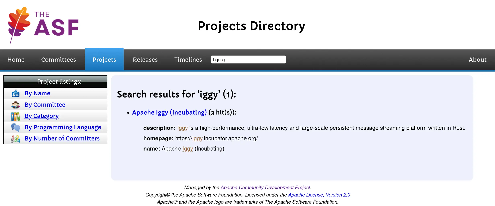
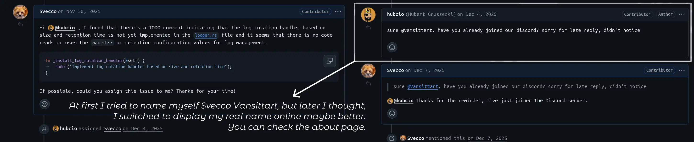
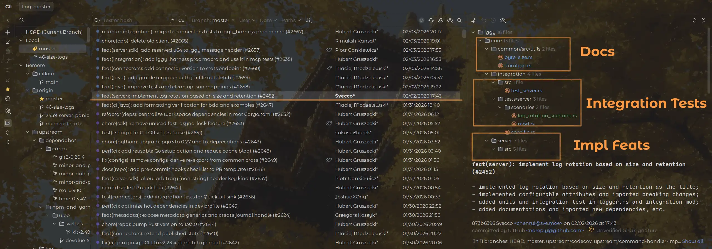
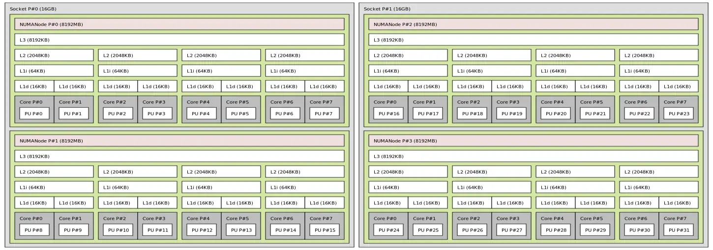
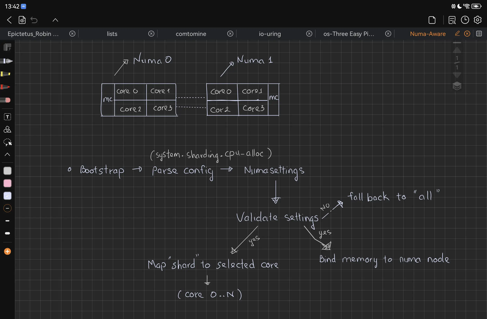
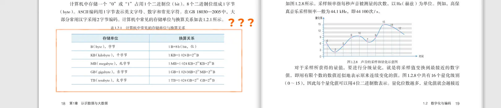
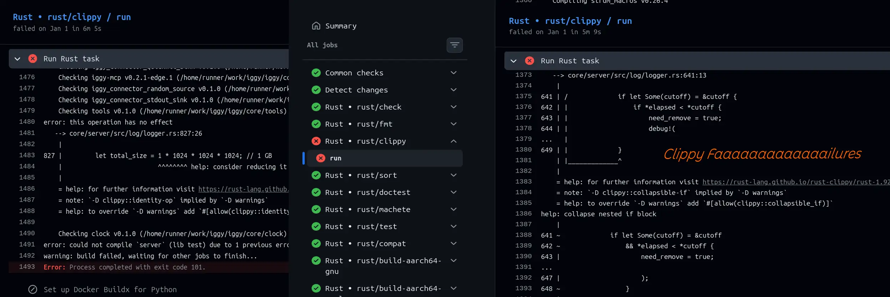
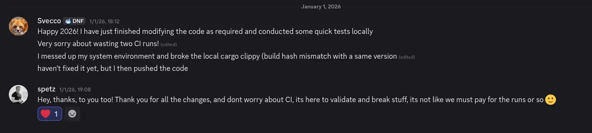
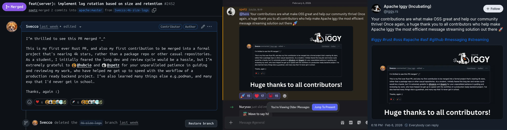

:::important[Summary]
_This article describes the process of my contributions to open source
projects under [_**the Apache Software Foundation**_](https://apache.org/)
, while also sharing some of my personal insights._
:::

:::tip[About Apache]
_**The Apache Software Foundation**_, a 
[U.S. 501(c)(3)](https://www.irs.gov/charities-non-profits/charitable-organizations/exemption-requirements-501c3-organizations)
**non-profit** foundation committed to software
[for the public good](https://apache.org/foundation/) 
with the 
["Community over Code"](https://en.wikipedia.org/wiki/Community_Over_Code) 
ethos, manages hundreds[^apache1] of influential **open source** projects that underpin
core infrastructure in cloud, big data and web industries, based on community
and sponsors, boasting an ecosystem valued at over
[**$30 Billion USD**](https://news.apache.org/foundation/entry/apache-software-foundation-celebrates-25-years)
.[^apache2]
:::

[^apache1]: **The Apache Software Foundation**, [*Apache Software Foundation Celebrates 25 Years*](https://news.apache.org/foundation/entry/apache-software-foundation-celebrates-25-years), _Mar. 25, 2024_. [Accessed: Feb. 13, 2026]. [Online].

[^apache2]: **The Apache Software Foundation**, [*Valuating Code at The Apache Software Foundation*](https://apache.org/foundation/docs/Valuating_Code_at_the_ASF.pdf), DinoSource, _2022_. [Accessed: Feb. 13, 2026]. [Online].

:::tip[About Iggy]
[_**Apache Iggy**_](https://iggy.apache.org/), an 
[incubating](https://incubator.apache.org/) 
open source message streaming project at The ASF, is a *Rust* built, 
ultra **low latency** persistent platform that processes **millions of messages 
per second** to power high efficiency rt data pipelines and cloud 
native streaming workloads at 
[**laser speed**](https://benchmarks.iggy.apache.org/).
:::

:::note[When Editing]
The **syntax** has been **corrected** much by **LLM**; This article has been done
on **February 20, 2026,** after 
[contributing](https://github.com/apache/iggy/pull/2452/changes) 
over 1,000 lines of
codes. The name `Svecco` was finalized on **November 30, 2025**, and I
asked [**@Hubcio**](https://hubcio.dev/) 
the [same day](https://github.com/apache/iggy/issues/46#issuecomment-3592167946)
, so I marked it initialized on the same day.
:::

---

# How Did I Know With
## The ASF

In **2021**, I learned about [_**Log4j**_](https://www.cisa.gov/news-events/news/apache-log4j-vulnerability-guidance)[^CVE-2021-44228-1]
([_**CVE-2021-44228**_](https://nvd.nist.gov/vuln/detail/CVE-2021-44228))[^CVE-2021-44228-2]
`CVSSv3 10.0/10.0` vulnerability[^CVE-2021-44228-3].      
_I'm sorry to have gotten to know you this way._

[^CVE-2021-44228-1]: **America's Cyber Defense Agency**, [*Apache Log4j Vulnerability Guidance*](https://www.cisa.gov/news-events/news/apache-log4j-vulnerability-guidance), ED 22-02, _Apr. 08, 2022_. [Accessed: Feb. 13, 2026]. [Online].

[^CVE-2021-44228-2]: **Apache Software Foundation**, [*Apache Log4j*](https://logging.apache.org/log4j/), _Dec. 9, 2021_. [Online]. (Log4Shell, CVE-2021-44228: Remote Code Execution (RCE) vulnerability, CVSSv3 10.0/10.0 severity)

[^CVE-2021-44228-3]: **CrowdStrike**, [*Remote Code Execution (RCE)*](https://www.crowdstrike.com/en-us/cybersecurity-101/cyberattacks/remote-code-execution/), [Online].


## The Apache Iggy

This brings me to **the situation** I had in **early November 2025**.

**First**, while I already knew how to use proxies
in the _5th_ grade, 
and **"could write"**[^jv] Java code in the _6th_ grade, I made virtually not 
so many contributions to the open source community **from 2021 to 2024**. 
The reason is quite straightforward, I was obsessed with 
[_**Minecraft**_](https://minecraft.net/) 
during the **2021** academic year, immersed in 
[_**Genshin Impact**_](https://genshin.hoyoverse.com/en/) (**Asia** Server)
in **2022**, and took up [_**Arknights**_](https://www.arknights.global/)
in **2023**. These three distractions 
completely squandered most of my time that could have been spent 
tinkering with distros and coding langs[^addicted].

[^jv]: **J. Gardner**, [*Why Java Sucks*](https://tech.jonathangardner.net/wiki/Why_Java_Sucks), _Jul. 18, 2017_. [Accessed: Feb. 14, 2026]. [Online].

[^addicted]: At my worst during this period, I even forgot the name
of the PCIe interface. I didn’t know how to use 
[_**Tmux**_](https://en.wikipedia.org/wiki/Tmux) either. 
I truly admire some middle students who can code 
proficiently and contribute actively to various projects 
something I couldn’t do as a high school student. It was 
not until late 2023 to early 2025 that I gradually got 
back on track with [_**Ubuntu**_](https://ubuntu.com/).

Despite my early start in tech, I lack **extensive experience** in multiple 
areas, not just *development experience*, but also *collaboration experience*. 
This deficiency is already evident in my use[^git_usage] of **Git**, and more shortcomings
will quickly surface once I engage in actual development. These shortcomings 
are not merely limited to not knowing how to use [_**Docker**_](https://www.docker.com/)
or [**distributed compilers**](https://wiki.gentoo.org/wiki/Distcc)
, but extend to **basic coding standards**. Thus, my needs became clear from now on:

[^git_usage]: For instance, when I have created multiple commits locally,
while the remote branch has updated some of these commits via a `squash merge`,
I would create a new branch and then `cherry-pick` the desired commits *one by one*
... Obviously, `rebase --onto` is fine.

1. A **small** or **mid** scale open source project, better led by an 
organization or enterprise, to correct my various bad habits;
2. A project in its **early**/**mid-stage** of development with 
active maintainers, Learn effective communication;
3. The project itself should have a steady pace of **progress**;
4. The project **language** I prefer to use.



This led me to Apache. After reading their 
[_charter and mission_](https://www.apache.org/foundation/how-it-works/), 
finding their GitHub account, and 
[conducting searches](https://github.com/orgs/apache/repositories?q=language%3ARust+visibility%3Apublic+license%3Aapache-2.0+sort%3Astars), 
I discovered that _**Apache Iggy**_ was the **only** project 
that fully met all the above requirements.

::github{repo="apache/iggy"}

---

# Ask for Assignment

## Pick Up One Issue

The Apache Software Foundation encourages people to 
[contribute](https://community.apache.org/contributor-ladder.html). 
Volunteers who are unsure where to
[start](https://community.apache.org/contributors/) 
can take a look at the project’s 
[good first issues](https://community.apache.org/committers/good-first-issues.html). 
That’s how I began too: I picked the 
[oldest unclaimed issue](https://github.com/apache/iggy/issues/46). 
The reason was simple. As a Chinese high school student, 
I had **less than 20 hours** available **per weekend**, and my 
skills were **rusty**, so I was worried the work would 
_drag on for a long time_.

:::note[Contributor Ladder]
First, you are a _**contributor**_, then you are a _**committer**_, 
and finally you are a _**PMC member**_ or more highers.
You may notice that there are also _**PPMC**_, which is member of 
[_**Podling Project Management Committee**_](https://incubator.apache.org/guides/ppmc.html#podling_project_management_committee_ppmc)
, belongs to [_**Apache Incubator**_](https://incubator.apache.org/).
:::

:::important[_**GitHub**_ is Not Necessary]
Apache projects are **NOT** necessarily hosted on _**GitHub**_. 
Many long established Apache projects still use 
[_**Apache SVN**_](https://subversion.apache.org/) 
as their primary version control system and
[_**Bugzilla**_](https://www.bugzilla.org/) 
for issue tracking, like
[_**Apache HTTP Server Project**_](https://httpd.apache.org/),
rather than _**GitHub**_'s 
Issues and Pull Requests mechanism.
:::

## Ask the Collaborators

I figured an issue that had
been around for a long time probably meant it was
**important** but **not urgent** for the maintainers,
which would alleviate the mess on them from my slow progress.

:::hyperlink{href="https://github.com/spetz" title="Piotr Gankiewicz" avatar="/assets/links/Spetz_2419600.webp" description="@spetz. Software Engineer, Iggy Founder, Apache PPMC."}
:::

:::hyperlink{href="https://hubcio.dev" title="Hubert Gruszecki" avatar="/assets/links/Hubcio_5490304.webp" description="@hubcio. Another crab enthusiast, Apache PPMC."}
:::

By checking who merged the pull requests, we could easily tell who 
has write access. I made an attempt sending a request to 
[**@hubcio**](https://hubcio.dev/) . He **agreed** promptly.
Later, [**@spetz**](https://github.com/spetz)
also joined the code review. **@hubcio** and **@spetz** are
highly efficient and responsible collaborators.
_They're both **Members**, and **PPMCs**_.



:::note[Communication Methods]
Email communication is also recommended at times, which might be **PUBLIC**.
You can receive real-time messages from mailing lists by sending a subscription confirmation.
_For instance:_
:::


---

# Get On Work

:::warning[About _**Preparation**_ and **_Learn the Structure_** sections]
Content available in the project manual, so I will not elaborate and only cover it briefly.
:::

## Preparation

_**Iggy**_ can be deployed with _**Docker**_ easily:

```shell title="Deploy Iggy with Docker Directly, According to the Official Documentation"
docker pull apache/iggy:latest
docker run --cap-add=SYS_NICE --security-opt seccomp:unconfined --ulimit memlock=-1:-1 apache/iggy:latest
```

Just like when making contributions normally, first read through
[the Code of Conduct](https://www.apache.org/foundation/policies/conduct),
[Contributing Guidelines](https://github.com/apache/iggy/blob/master/CONTRIBUTING.md),
and then make a fork, syncing. Besides, _**Iggy**_ also provides a `cli`.

```shell title="Fish Session" collapse={1-2}
git clone git@github.com:Svecco/iggy.git
cd ./iggy/ && ssh-add ~/.ssh/id_ed25519
git checkout -b 46-size-logs upstream/master
cargo install iggy-cli && iggy --help
```

_Nearly all medium or large modern Rust projects_ 
adopt the workspace mechanism. I'm not sure why 
so many Rust learning materials don't cover it 
as a key topic, including 
_**the Programming Rust, 2nd Edition**_ I have right now.

```log title="You'd Better Prepare Some Time Waiting for Cargo Building" collapse={1-4, 7-8, 12-16}
╭─ $ [svecco] ~/A/iggy git!(46-size-logs)
╰─ > cargo clean
     Removed 65558 files, 52.1GiB total
╭─ $ [svecco] ~/A/iggy git!(46-size-logs)
╰─ > time sh -c 'cargo build --all-features --all-targets --workspace --release 2>&1 | tail -1'
    Finished `release` profile [optimized] target(s) in 3m 18s

________________________________________________________
Executed in  198.65 secs    fish           external
   usr time   51.93 mins  407.00 micros   51.93 mins
   sys time    1.46 mins   61.00 micros    1.46 mins
╭─ $ [svecco] ~/A/iggy git!(46-size-logs)
╰─ > lscpu | grep "AMD"
Vendor ID:                               AuthenticAMD
Model name:                              AMD Ryzen 9 9950X 16-Core Processor
Virtualization:                          AMD-V
```

From the **project specifications**, you can also see how to format your code:

:::note[About Clippy and Check]
Clippy is a **superset** of check. _Usually, if Clippy passes,
you don’t need to run check._
:::

```shell title="You Can Use Prek to Handle Them By Once"
cargo fmt --all && cargo sort --workspace && cargo machete
cargo clippy --all-targets --all-features -- -D warnings
bash ./scripts/ci/licenses-list.sh --update --fix
bash ./scripts/ci/trailing-whitespace.sh --check --fix
# cargo check --all-targets --all-features
```

```shell title="Use This To Run Benchmarks"
cargo run --bin iggy-bench -- -T 50000MB pp -p 5 quic
```

## Learn the Structure

_**Iggy** data model_, aligned with mainstream message queue, but has own naming convention.[^iggy_docs]

[^iggy_docs]: **The Iggy Docs**, [*Apache Iggy Documentation*](https://iggy.apache.org/docs/), _n.d._ [Accessed: Feb. 22, 2026]. [Online].

| Concept     | Core Description                                                                               |
|-------------|------------------------------------------------------------------------------------------------|
| `Stream`    | Top-level namespace isolating business/project message data.                                   |
| `Topic`     | Message classification under Stream; maps to message queue; one Stream has many Topics.        |
| `Partition` | Parallel unit under Topic; determines concurrency; one Topic has many Partitions.              |
| `Message`   | Smallest data carrier; contains payload, ID, timestamp, offset, custom headers.                |
| `Consumer`  | Message consumption endpoint; supports pull by offset, timestamp, batch; auto-commits offsets. |

_**Iggy**_'s core business data model and interaction logic. It defines the nested hierarchy from the top-level namespace **Stream** down to the atomic data unit **Message**, and standardizes the core **send/poll** operations between producers and consumers.

$$
\mathbf{BA} \equiv \begin{cases}
\mathbf{Hierarchy}: & \mathbf{Stream} \supset \mathbf{Topic} \supset \mathbf{Partition}_i \supset \mathbf{Message}_{i,j} \\
& (i,j \in \mathbb{N}^+) \\[0.4em]
\mathbf{Flow}: & \mathbf{Producer} \xrightarrow{\text{Send}(s,t,p,m)} \mathbf{Partition}_p \\
& \mathbf{Consumer}_c \xrightarrow{\text{Poll}(s,t,p,o,k)} \left\{ \mathbf{Message}_{p,o}, \dots \right\}
\end{cases}
$$

_**Iggy**_'s layered technical architecture. It maps the complete end-to-end data path from multi-language SDK clients through the **transport layer** and **core processing engine** to the **persistent storage layer**, along with the officially supported **transport protocol** options.

$$
\mathbf{TA} \equiv \begin{cases}
\mathbf{Layers}: & \mathbf{Client_{SDK}} \xrightarrow{\mathcal{R}} \mathbf{Transport_{[4\text{-}prot]}} \\
& \mathbf{Transport} \xrightarrow{\mathcal{D}} \mathbf{Core_{[Mgmt|HB|Router]}} \\
& \mathbf{Core} \xrightarrow{\mathcal{P}} \mathbf{Storage_{[Seg|Idx|Meta]}} \\[0.4em]
\mathbf{Constraints}: & \mathcal{C}(\mathbf{Transport}) \equiv \left( \mathbf{TCP} \lor \mathbf{HTTP} \lor \mathbf{QUIC} \lor \mathbf{WS} \right)
\end{cases}
$$

_**Iggy**_'s two core end-to-end workflows: **message production** and **consumption**. It details the full **lifecycle** of a message, covering client authentication, routing and persistent append for production, as well as subscription, batch fetching and **offset commit** for consumption.

$$
\mathbf{Workflow} \equiv \mathbf{WF_{Prod}} \land \mathbf{WF_{Cons}} \\[0.6em]
\mathbf{Workflow_{Prod}} \equiv \mathbf{Producer} \xrightarrow{\text{Connect}} \mathbf{Transport} \xrightarrow{\text{Auth}(u,p)} \mathbf{Core} \\
\quad \xrightarrow{\text{Route}(s,t,p)} \mathbf{Partition} \xrightarrow{\text{Append}(m)} \mathbf{Storage_{Seg}} \\[0.6em]
\mathbf{Workflow_{Cons}} \equiv \mathbf{Consumer} \xrightarrow{\text{Subscribe}(s,t)} \mathbf{Core} \xrightarrow{\text{Poll}(p,o,k)} \mathbf{Storage_{Seg}} \\
\quad \xrightarrow{\text{Read}(o,k)} \left\{ m_1, \dots, m_k \right\} \xrightarrow{\text{Commit}(o+k)} \mathbf{Core}
$$


| **Path**                           | **Work**                     |
|------------------------------------|------------------------------|
| <u>core/server/src/**configs**</u> | <u>*Config management*</u>   |
| <u>core/server/src/**log**</u>     | <u>*Logging management*</u>  |

_And for the issue, for example_, [server.toml](https://github.com/apache/iggy/blob/master/core/server/config.toml) 
controls the default configuration file, while
[defaults.rs](https://github.com/apache/iggy/blob/master/core/server/src/configs/defaults.rs) 
handles the parsing of default values, and 
[validators.rs](https://github.com/apache/iggy/blob/master/core/server/src/configs/validators.rs) 
is responsible for validating data integrity preventing issues like 
rotation times approaching zero[^zero_value], for instance.

[^zero_value]: Initially, I aimed to avoid division by zero
errors by outright blocking any operation that set the 
value to zero. Later, I noticed that `IggyByteSize` actually 
defines a specific meaning for the zero value, so I
revised the logic to treat it as
["unlimited"](https://github.com/search?q=repo%3Aapache%2Figgy+byte_size.rs+%22unlimited%22&type=code) 
to align with the behavior stated in comments throughout the
rest of the codebase.

In the `integration` phase, as the name, we perform integration testing, 
which _fully_ and _independently_ implements features testing. Relying **solely**
on **unit test**ing is **insufficient** for **complex projects** involving 
overall system operation.



## Implementing Feats

```rust title="core/server/src/log/logger.rs:Mainly Functions"
fn calculate_max_files(max_total_size, max_file_size,) -> usize { ... }
fn install_log_rotation_handler(&self, config, logs_path,) -> Option<()> { ... }
fn run_log_rotation_loop(path, retention, ... , check_interval, should_stop, rx,) { ... }
fn read_log_files(logs_path) -> Vec<(fs::DirEntry, SystemTime, Duration, u64)> { ... }
fn cleanup_log_files(logs_path, retention, max_total_size, max_file_size,) { ... }
impl Drop for Logging { fn drop(&mut self) { ... } }
```

_Logically, the implementation is straightforward_, divide `max_total_size` 
by `max_file_size` to get the _upper limit of the quantity_, then read 
the `rotation_check_interval` and `retention` cycles configured by the
user. After that, _push file entries_ to
`Vec<(fs::DirEntry, SystemTime, Duration, u64)>`, after calculating, for 
deletion according to these scheduled timings, and finally remove
a batch.

```rust title="core/integration/tests/server/scenarios/log_rotation_scenario.rs:Mainly Functions"
fn is_valid_iggy_log_file(file_name,) -> bool { ... }
async fn run(client_factory, log_dir, present_log_config,) { ... }
async fn init_valid_client(client_factory,) -> Result<IggyClient, String> { ... }
async fn generate_enough_logs(client,) -> Result<(), String> { ... }
async fn validate_log_rotation_rules(log_dir, pre_config,) -> Result<(), String> { ... }
async fn nocapture_observer(log_path, title, done,) -> () { ... }
```

```toml title="873b63965998e07ed7b50994286d1397b6359dd5: server.toml -> config.toml 96%" {"max_size -> max_file_size, which is breaking change":6-7, 18-20} del={"Remove old configurations":9-10} ins={ "Added other configurable options":1-5, 12-16, 22-24 } collapse={2-5, 11-15, 17-19, 21-23}
# Maximum size of a single log file before rotation occurs. When a log
# file reaches this size,  it will be rotated   (closed and a new file
# created). This setting works together with max_total_size to control
# log storage.  You can set it to 0 to enable unlimited size of single
# log,  but all logs will be written to a single file,  thus disabling
# log rotation. Please configure 0 with caution, esp. RUST_LOG > debug
max_file_size = "500 MB"

# Maximum size of the log files before rotation.
max_size = "512 MB"

# Maximum total size of all log files.  When this size is reached,
# the oldest log files will be deleted first. Set it to 0 to allow
# an unlimited number of archived logs. This does not disable time
# based log rotation or per-log-file size limits.
max_total_size = "4 GB"


# Time interval for checking log rotation status. Avoid less than 1s.
rotation_check_interval = "1 h"


# Time to retain log files before deletion. Avoid less than 1s, too.
retention = "7 days"
```

The above are *configuration level changes*, and you can also see what
has been implemented from here. Of course, for more specific details, 
you may as well directly use the *commit hash* to check the `git` log
to find out about 
[other additions and deletions](https://github.com/apache/iggy/pull/2452/changes/).
Since the issues people
encounter are diverse, and log rotation is not highly technical, 
going into detail here would *sacrifice general applicability*. So, 
I won’t elaborate on the *general implementation details* here,
instead, _I will choose to pick things that I find quite interesting up later_.

```shell title="Git Console"
git show 873b63965998e07ed7b50994286d1397b6359dd5 --stat
```

```log title="Git Log Search Output in Stat" collapse={3-30} {"Avoid Losing Path, which is */server/scenarios/*":19-20}
╭─ $ [svecco] ~/A/iggy git!(master)
╰─ > git show 873b63965998e07ed7b50994286d1397b6359dd5 --stat
commit 873b63965998e07ed7b50994286d1397b6359dd5
Author: Svecco <chenrui@sve.moe>
Date:   Mon Feb 2 17:43:48 2026 +0800

    feat(server): implement log rotation based on size and retention (#2452)
    
    - implemented log rotation based on size and retention as the title;
    - implemented configurable attributes and imported breaking changes;
    - added units and integration test in logger.rs and integration mod;
    - added documentations and imported new dependencies, etc.

 Cargo.lock                                           |  21 +
 DEPENDENCIES.md                                      |   2 +
 core/common/src/utils/byte_size.rs                   |   7 +
 core/common/src/utils/duration.rs                    |  29 ++
 core/integration/src/test_server.rs                  |   4 +-
 
 core/integration/tests/S/S/log_rotation_scenario.rs  | 382 +++++++++++++++++
 core/integration/tests/server/scenarios/mod.rs       |   1 +
 core/integration/tests/server/specific.rs            |   5 +-
 core/server/Cargo.toml                               |   2 +
 core/server/config.toml                              |  22 +-
 core/server/src/configs/defaults.rs                  |   9 +-
 core/server/src/configs/displays.rs                  |   8 +-
 core/server/src/configs/system.rs                    |   7 +-
 core/server/src/configs/validators.rs                |  47 ++-
 core/server/src/log/logger.rs                        | 475 +++++++++++++++++++++-
 foreign/cpp/tests/e2e/server.toml                    |  26 +-
 16 files changed, 1009 insertions(+), 38 deletions(-)
```

## Panicked OOM Code 12 with 44GiB RAM Empty?!
```shell title="Problem Reproduction"
git reset --hard ff6695ba589656acef68da534b4af55dda452c80 && cargo build --package server
CPU_ALLOCATION="<more than your PHYSICAL cores>" RUST_BACKTRACE=1 cargo run --bin server
```

:::important[Couldn't Load Data From Disk?]
That's because the process attempted to read an incompatible system metadata file under
the `./local_data/` directory. Just remove the `./local_data/` directory and try again.
:::

:::warning[Regarding the Num of Cores]
On my device, testing shows that `cpu_allocation = "19"` is the limit,
_with single one 32 logical cores, distributed off._
Might require a machine with ~~many cores~~ no, but 
[_**SMT**_](https://www.amd.com/en/blogs/2025/simultaneous-multithreading-driving-performance-a.html) 
to trigger.[^amd_smt]
:::

[^amd_smt]: **A. Kotsiolis**, [*Simultaneous Multithreading: Driving Performance and Efficiency on AMD EPYC CPUs*](https://www.amd.com/en/blogs/2025/simultaneous-multithreading-driving-performance-a.html), AMD Official Blog, _Mar. 3, 2025_. [Accessed: Feb. 14, 2026]. [Online].

Generally speaking, this situation occurs because the *requested memory allocation is too large*. 
The malloc function is *overwhelmed* and *just kills the process* (tears included). But you can
check out, and, find there may something incorrect, but you don't know exactly what it is:

```log title="ulimit -m && ulimit -v && cat /proc/sys/vm/overcommit_memory"
unlimited, unlimited, 0
```

That's very strange for me. There are **no external restrictions**, on the contrary,
**resources are sufficient**, yet it still fails to start, So this is an *internal* server issue?

```log title="Flood Full of These Panics"
2026-02-13T10:08:28.268923Z ERROR     main iggy_server: Server shutting down due to shard failure. (shutdown took 31 ms)
Error: ShardFailure { message: "Shard 22 panicked: called `Result::unwrap()` on an `Err` value: Os { code: 12, kind: OutOfMemory, message: \"Cannot allocate memory\" }" }
```
```log title="When Editing the Essay: free -h | head -n 2"
          total        used        free      shared  buff/cache   available
Mem:      46 Gi       20 Gi      772 Mi      199 Mi       24 Gi       26 Gi
```

Since the error is occurring with the `shard`, let's look into
the code that implements the `shard` functionality.
Let's check how the `shard` allocated.

```rust title="core/server/src/configs/sharding.rs::CpuAllocation" del={"Bind cores one by one?":8-9}
impl CpuAllocation {
    pub fn to_shard_set(&self) -> HashSet<usize> {
        match self {
            CpuAllocation::All => {
                let available_cpus = available_parallelism()
                    .expect("Failed to get num of cores")
                    .get();

                (0..available_cpus).collect()
            }
            CpuAllocation::Count(count) => (0..*count).collect(),
            CpuAllocation::Range(start, end) => (*start..*end).collect(),
        }
    }
}
```

This code that executes kernel allocation _seems harmless_ enough at first 
glance, yet there appears to be something off about it. The cores 
are allocated via `available_parallelism()`, `man` it, see what can we get
from the [documentations](https://doc.rust-lang.org/stable/std/thread/fn.available_parallelism.html).

> #### **Limitations** [^doc] / `pub fn available_parallelism() -> Result<NonZero<usize>>`
>
> _The purpose of this API is to provide an easy and portable way to_ 
> _query the default amount of parallelism the program should use._ 
> _Among other things it **does not expose information on NUMA regions**,_ 
> _does not account for differences in (co)processor capabilities or_ 
> _current system load, and will not modify the program’s global state_ 
> _in order to more accurately query the amount of available parallelism._
>

[^doc]: **Rust Team**, [*The Rust Standard Library (std)*](https://doc.rust-lang.org/stable/std/index.html), Commit 01f6ddf75, _Feb. 11, 2026_. [Accessed: Feb. 14, 2026]. [Online].

"_**NUMA** regions_"? What is "_**NUMA**_"?

In early computer systems, all `CPU` accessed memory through a single
bus, an architecture known as **_SMP_**[^smp].
All `CPU` were **equal**, with no master slave relationship. As the number
of processors increased, the system bus became a *critical system 
bottleneck*, leading to significant latency in communication 
between processors and memory.

[^smp]: **J. L. Hennessy** & **D. A. Patterson**, [_Computer Architecture: A Quantitative Approach (6th Edition)_](https://archive.org/details/computerarchitectureaquantitativeapproach6thedition/mode/2up), Elsevier, 2017. [Accessed: Feb. 14, 2026]. [Online].

:::tip[From the Hardware Architecture]
In the **_NUMA_** architecture, 
`CPU` are divided into multiple **_NUMA Nodes_**. Each node has its 
own independent memory space and `PCIe` bus subsystem. Intercommunication 
between `CPU` is achieved via the `QPI` bus.[^hardware_loc]
:::



[^hardware_loc]: **Wikipedia Contributors**, [*Non-uniform memory access*](https://en.wikipedia.org/wiki/Non-uniform_memory_access), Wikipedia, The Free Encyclopedia, _2026_. [Accessed: Feb. 14, 2026]. [Online].

The speed at which a `CPU` accesses memory from different node 
types varies: access to the *local node* is the fastest, 
_while access to remote nodes is the **slowest**_. In other words,
memory access speed depends on the distance to the node, the 
greater the distance, the **slower** the access. This is why it
is called **_NUMA_**. The memory 
access distance is referred to as **Node Distance**.

This architecture effectively solves the *performance issues
caused by large scale `CPU` expansion* under the **SMP** model.[^zhihu]
This means: This piece of code directly maps abstract `CPU` allocation 
rules to a set of logical `CPU` core IDs, where `cpu_allocation = "all"` 
generates a set with a size **equal** to the number of logical cores 
reported by the system. In this scenario, _**32**_ `shards` are created 
instead of **_16_**, which triggers two cascading issues: first, 
multiple `shards` are bound to the _**SMT**_ threads of the same physical 
core, resulting in resource contention. Second, the _**32**_ `shards`, 
combined with the **pre-allocated** memory pool, generate **a massive 
amount of instantaneous memory requests**. This value exceeds the 
kernel's heuristic memory overcommit threshold `vm.overcommit_memory=0`,
thereby triggering [Code 12](https://www.kernel.org/doc/html/latest/index.html) 
and causing `shard` crashes.[^hwloc_crate_doc]

Now, we can *examine the source code* to see **why the documentation states this**.

[^hwloc_crate_doc]: Crate `hwloc`: 
[_**Rust Bindings**_](https://docs.rs/hwloc/latest/hwloc/) 
for the Hwloc library. The `hwloc` library is a `rust` binding to the `hwloc` 
C library, which provides a portable abstraction of the hierarchical topology 
of modern architectures, including _**NUMA**_ memory nodes, sockets, shared caches,
cores and simultaneous multithreading.

```rust title="rustlib::std/src/sys/thread/unix.rs::available_parallelism" del={"Relies solely on cpu affinity & cgroups quota, no NUMA node topology": 7-8} del={"Returns raw cpu count from affinity mask not accounting for NUMA locality": 21-22} del={"Fall back to sysconf _SC_NPROCESSORS_ONLN which is NUMA agnostic": 28-29} collapse={2-5, 10-20, 23-26, 30-33}
pub fn available_parallelism() -> io::Result<NonZero<usize>> {
    cfg_select! {
        any(target_os = "linux") => {
            #[cfg(any(target_os = "android", target_os = "linux"))]
            {
                quota = cgroups::quota().max(1);
                
                let mut set: libc::cpu_set_t = unsafe { mem::zeroed() };
                unsafe {
                    if libc::sched_getaffinity(0, size_of::<libc::cpu_set_t>(), &mut set) == 0 {

                        let count = libc::CPU_COUNT(&set) as usize;
                        let count = count.min(quota);
                        
                        if let Some(count) = NonZero::new(count) {
                            return Ok(count) 
                        }
                    }
                }
            }

            match unsafe { libc::sysconf(libc::_SC_NPROCESSORS_ONLN) } {
                -1 => Err(io::Error::last_os_error()),
                0 => Err(io::Error::UNKNOWN_THREAD_COUNT),
                cpus => {
                    let count = cpus as usize;
                    let count = count.min(quota);

                    Ok(unsafe { NonZero::new_unchecked(count) })
                }
            }
        }
    }
}
```

[^zhihu]: **@linux**, [*What is NUMA, and why do we need to understand NUMA?*](https://zhuanlan.zhihu.com/p/643610982), Zhihu, Linux Server Development Column, _Jul. 14, 2023_. [Accessed: Feb. 14, 2026]. [Online].

**Over? _Nope, still a little_**. I found **this option** in the
[configuration](https://github.com/apache/iggy/blob/master/core/server/config.toml):

```toml title="ff6695ba589656acef68da534b4af55dda452c80::core/configs/server.toml::line::500-505" {"I found that when I reduce it, it doesn’t OOM sometimes.":6-7}
# Size of the memory pool (string).
# Example: "512 MiB" or "1 GiB".
# This defines the maximum, total memory allocated for the memory pool.
# Note: This number has to be multiplication of 4096 (default linux page size).
# Minimum size is 512 MiB due to internal implementation details.

size = "4 GiB"
```

Reducing the memory pool size (e.g., from **4 GiB** to **1 GiB**) lowers the initial
pre-allocation peak and decreases the total instantaneous memory demand. 
This value may fall within the kernel’s **_“repayable”_** memory range, allowing 
the server to start **occasionally**.

However, this only alleviates the symptoms and does not address the root cause. 
Physical cores and _**SMT**_ threads are not distinguished, nor is there a limit
on the maximum number of `shard`. Ultimately, this amplifies memory pressure
to the point of triggering an _**OOM**_ error on _**SMT**_ enabled multi cores `CPU`.

:::tip[When the First Time I Encountered This]
Of course, I didn’t know any of this at the beginning of the pull request,
nor did I realize it was a _**NUMA**_ issue. I was _**fixated entirely**_ 
on the _**memory side**_ and was just about to file an issue. After fetching,
the problem was suddenly resolved. With some locates, let’s take a look
at the commit _that fixed the issue_.
```shell title="addressing #2387, feat(server): NUMA awareness (#2412), committed by @tungtose"
git show a5d569450ee34441be997786046c7a30785e11f2 --stat
```
:::



:::tip[Links to the Original Issue and Pull Request]
The issue was **handled** by [_**@tungtose**_](https://github.com/tungtose)
, and the image **above** was **the flow he drew**.
You can find the original issue 
[_**#2387**_](https://github.com/apache/iggy/issues/2387) 
here, filed by 
[_**@hubcio (Hubert Gruszecki)**_](https://github.com/hubcio)
, and the original pull request here
[_**#2412**_](https://github.com/apache/iggy/pull/2412).
**Merged** by [_**@spetz (Piotr Gankiewicz)**_](https://github.com/spetz)
on [Dec 15, 2025](https://github.com/apache/iggy/pull/2412#event-21560708880).
:::

```toml title="Cargo.toml" ins={"Imported hwlocality lib by @tungtose":1-2}
# line 135
hwlocality = "1.0.0-alpha.11"
```

```rust title="core/server/src/configs/sharding.rs" ins={"NumaConfig struct definition by @tungtose": 1-7} ins={"NumaTopology struct definition by @tungtose": 9-16} collapse={4-6, 12-15}
// line 50
#[derive(Debug, Clone, PartialEq, Default)]
pub struct NumaConfig {
    pub nodes: Vec<usize>,
    pub cores_per_node: usize,
    pub avoid_hyperthread: bool,
}

// line 178
#[derive(Debug)]
pub struct NumaTopology {
    topology: Topology,
    node_count: usize,
    physical_cores_per_node: Vec<usize>,
    logical_cores_per_node: Vec<usize>,
}
```

```rust title="core/server/src/configs/sharding.rs" ins={"NUMA node topology detection by @tungtose": 3-5} ins={"NUMANode object lookup by @tungtose": 9-12} ins={"Memory binding to local NUMA node by @tungtose": 19-25} collapse={6-8, 13-17, 22-36}
impl ShardInfo {
    pub fn bind_memory(&self) -> Result<(), ServerError> {

        if let Some(node_id) = self.numa_node {
            let topology = Topology::new().map_err(|err| ServerError::TopologyDetection {
                msg: err.to_string(),
            })?;


            let node = topology
                .objects_with_type(ObjectType::NUMANode)
                .nth(node_id)
                .ok_or(ServerError::InvalidNode {
                    requested: node_id,
                    available: topology.objects_with_type(ObjectType::NUMANode).count(),
                })?;

            if let Some(nodeset) = node.nodeset() {

                topology
                    .bind_memory(
                        nodeset,
                        MemoryBindingPolicy::Bind,
                        MemoryBindingFlags::THREAD | MemoryBindingFlags::STRICT,
                    )
                    .map_err(|err| {
                        tracing::error!("Failed to bind memory {:?}", err);
                        ServerError::BindingFailed
                    })?;

                info!("Memory bound to NUMA node {node_id}");
            }
        }

        Ok(())
    }
}
```

Although I don't understand it many[^hwlocality], it's much better than the 
**indiscriminate thread allocation** based on simple `CPU` sets 
from `available_parallelism()`. And even more delightful is 
_that as a newcomer, ~~I can finally write code happily~~_.

[^hwlocality]: **hwlocality Developers**, [*hwlocality: Rust binding for hwloc*](https://docs.rs/hwlocality/latest/hwlocality/), [Online]. (Designed for hardware topology detection, NUMA support, and thread binding optimization; secure, easy to use & actively maintained). [Accessed: Feb. 14, 2026].

:::hyperlink{href="https://github.com/tungtose" title="Tungtose" avatar="/assets/links/Tungtose_72777913.webp" description="@tungtose. No description provided."}
:::

## Wait, Some Compiling Dependencies Missing

It turns out that `hwloc-devel` was missing, maybe can infer that 
the bug has truly been fixed XD.

But something **still doesn't seem right**?

```log collapse={1-4, 8-12} {6}
thread 'main' (948800) panicked at /home/svecco/.cargo/registry/src/mirrors.tuna.tsinghua.edu.cn-4dc01642fd091eda/hwlocality-sys-0.6.4/build.rs:82:10:
Could not find a suitable version of hwloc:
pkg-config exited with status code 1
> PKG_CONFIG_ALLOW_SYSTEM_LIBS=1 PKG_CONFIG_ALLOW_SYSTEM_CFLAGS=1 pkg-config --static --libs --cflags hwloc 'hwloc >= 2.0.0' 'hwloc < 3.0.0'

The system library `hwloc` required by crate `hwlocality-sys` was not found.
The file `hwloc.pc` needs to be installed and the PKG_CONFIG_PATH environment variable must contain its parent directory.
The PKG_CONFIG_PATH environment variable is not set.

HINT: if you have installed the library, try setting PKG_CONFIG_PATH to the directory containing `hwloc.pc`.

note: run with `RUST_BACKTRACE=1` environment variable to display a backtrace
```

_Of course_, we can _**instantly solve** this problem_ by installing `hwloc-devel` package via `dnf`:

```log collapse={1-3, 6-27}
Updating and loading repositories:
Repositories loaded.
Package                  Arch    Version                  Repository         Size
Installing:
 hwloc-devel             x86_64  2.12.0-2.fc43            fedora        665.3 KiB
Installing dependencies:
 infiniband-diags        x86_64  58.0-4.fc43              fedora        961.8 KiB
 libibumad               x86_64  58.0-4.fc43              fedora         43.9 KiB
 rdma-core-devel         x86_64  58.0-4.fc43              fedora        613.8 KiB

Transaction Summary:
 Installing:         4 packages

Total size of inbound packages is 1 MiB. Need to download 1 MiB.
After this operation, 2 MiB extra will be used (install 2 MiB, remove 0 B).
Is this ok [y/N]: y
[1/4] infiniband-diags-0:58.0-4.fc43.x86 100% | 611.2 KiB/s | 328.2 KiB |  00m01s
[2/4] hwloc-devel-0:2.12.0-2.fc43.x86_64 100% | 664.9 KiB/s | 361.0 KiB |  00m01s
[3/4] rdma-core-devel-0:58.0-4.fc43.x86_ 100% | 712.8 KiB/s | 429.8 KiB |  00m01s
[4/4] libibumad-0:58.0-4.fc43.x86_64     100% | 372.5 KiB/s |  27.2 KiB |  00m00s
---------------------------------------------------------------------------------
[4/4] Total                              100% |   1.8 MiB/s |   1.1 MiB |  00m01s
Running transaction
[1/6] Verify package files               100% |   1.3 KiB/s |   4.0   B |  00m00s
[2/6] Prepare transaction                100% |  19.0   B/s |   4.0   B |  00m00s
[3/6] Installing libibumad-0:58.0-4.fc43 100% |   2.3 MiB/s |  44.7 KiB |  00m00s
[4/6] Installing infiniband-diags-0:58.0 100% |  56.2 MiB/s | 978.7 KiB |  00m00s
[5/6] Installing rdma-core-devel-0:58.0- 100% |  41.7 MiB/s | 682.7 KiB |  00m00s
[6/6] Installing hwloc-devel-0:2.12.0-2. 100% |   2.7 MiB/s | 747.8 KiB |  00m00s
Complete!
```

But why does the installation of hwloc **still fail** when using `Nix`? _Go have some tries_.

```log
nixos-version:                  25.11.20251215.c6f52eb (Xantusia)
hwloc-info --version:           hwloc-info 2.12.2rc1-git
```

```log title="ls -la /nix/store/{LONG_HASH}-hwloc-2.12.2-dev/lib/pkgconfig/ | grep 'hwloc.pc'"
.r--r--r-- 439 root  1 Jan  1970 hwloc.pc
```

_Hmm... that's really puzzling_. But there's a **_somewhat hacky_** way to fix it.

```log title="PKG_CONFIG_PATH=/nix/store/{LONG_HASH}-hwloc-2.12.2-dev/lib/pkgconfig/ cargo build 2>&1"
Finished `dev` profile [unoptimized + debuginfo] target(s) in 0.33s
```

Let's look at the
[_**source code**_](https://github.com/NixOS/nixpkgs/blob/nixos-unstable/pkgs/by-name/hw/hwloc/package.nix#L74-L80).
_~~Ah~~_, if `hwloc.pc` is in the `dev` of the `nixpkgs`, there will be _**multiple outputs**_...
So I can't rely on installing it correctly by just adding the package name **directly**.

```nix title="nixpkgs/pkgs/by-name/hw/hwloc/package.nix:74-80"
outputs = [ "out" "lib" "dev" "doc" "man" ];
# "out" was the default output. Below was my installation: 
packages = with pkgs; [ hwloc ];
```

## IEC != SI

The picture below shows the textbook for 
[_**Information Technology**_](https://jc.pep.com.cn/) in _**Chinese senior high**_.



But **IT IS WRONG**[^iec-1]. The correct one is following 
[_**IEC 60027-2**_](https://en.wikipedia.org/wiki/IEC_60027)[^iec-2], which looks 
[like this](https://www.computernetworkingnotes.com/networking-tutorials/megabytes-mb-v-s-mebibytes-mib-differences-explained.html)[^iec-3].

| Units Computers Use | **IEC** | Value   | Units Hardware Vendors Use | **SI** | Value  |
|---------------------|---------|---------|----------------------------|--------|--------|
| Kibibyte            | **KiB** | 1024¹   | Kilobyte                   | **kB** | 1000¹  |
| Mebibyte            | **MiB** | 1024²   | Megabyte                   | **MB** | 1000²  |
| Gibibyte            | **GiB** | 1024³   | Gigabyte                   | **GB** | 1000³  |
| Tebibyte            | **TiB** | 1024⁴   | Terabyte                   | **TB** | 1000⁴  |
| Pebibyte            | **PiB** | 1024⁵   | Petabyte                   | **PB** | 1000⁵  |
| Exbibyte            | **EiB** | 1024⁶   | Exabyte                    | **EB** | 1000⁶  |
| Zebibyte            | **ZiB** | 1024⁷   | Zettabyte                  | **ZB** | 1000⁷  |
| Yobibyte            | **YiB** | 1024⁸   | Yottabyte                  | **YB** | 1000⁸  |

[^iec-1]: **CGPM**, [*SI*](https://www.iec.ch/si), Conférence Générale des Poids et Measures. [Online]. [Accessed: Feb. 14, 2026].

[^iec-2]: **I.E.C.**, [*IEC 60027*](https://en.wikipedia.org/wiki/International_Electrotechnical_Commission), International Electrotechnical Commission. [Online]. [Accessed: Feb. 14, 2026].

[^iec-3]: **Wikimedia Foundation, Inc.** & **I.E.C.**, Wikipedia, Nov. 2023. [Accessed: Feb. 14, 2026].

I didn’t know any at first, until started with 
_**the Apache Iggy**_, _**@Hubcio**_ pointed it out to me.

```rust title="Fake code, just for exhibiting."
 assert_eq!( return_bytes(1 GiB) ,        1000000000 ); 
/* Panicked. Left: 1073741824    , Right: 1000000000 */
```

## Are You Sure

Alright, _I'm not sure really_. I'll take a _closer_ look before `--force` it next time.
If I don't have enough time, **just test it later**,
also learn to write your own test scenarios.
**Don't always ask others to test features**,
it's not a good practice, and usually wastes maintainers' time.

Now, let's see _**what silly things**_ this guy [**@Svecco**](https://sve.moe/about) did.

```rust title="1/8 core/server/src/log/logger.rs: Please import rather than use solute path each time."
if let Err(e) = std::fs::create_dir_all(&logs_path) {
    tracing::warn!("Failed to create logs directory {:?}: {}", logs_path, e);
```

```rust title="2/8 core/server/src/log/logger.rs: All the magic figures, no matter how simple, please const"
// Check available disk space, at least 10MiB
let min_disk_space: u64 = 10 * 1024 * 1024;
```

```rust title="3/8 core/server/src/log/logger.rs: What are you doing?"
let max_files = Self::calculate_max_files(
    config.max_size.as_bytes_u64(),
    config.max_size.as_bytes_u64(),
```

```rust title="4/8 core/server/src/log/logger.rs: Do not add mutex, you even not sure really a thread issue."
let path = logs_path.to_path_buf();
let max_size = config.max_size.as_bytes_u64();
let retention = config.retention.get_duration();
let rotation_mutex = Arc::new(Mutex::new(()));
```

```rust title="5/8 core/server/src/configs/system.rs: Can you just copy? Which might even better."
fn default_max_total_log_size() -> IggyByteSize { IggyByteSize::from(4_000_000_000) }
fn default_log_rotation_check_interval() -> u64 { 3600 }
```

```rust title="6/8 core/server/src/log/logger.rs: 'How are you preventing active log file deletion?'"
fn install_log_rotation_handler(&self, config: &LoggingConfig, logs_path: Option<&PathBuf>) { ... }
```

```rust title="7/8 core/server/src/log/logger.rs: 'Use IggyDuration/IggyByteSize when you can :)'"
fn cleanup_log_files(logs_path: &PathBuf, retention: Duration, max_size_bytes: u64) {...}
```

```rust title="8/8 core/integration/tests/server/scenarios/log_rotation_scenario.rs: Is 'panick' in this way?"
match rotation_result {
    Ok(()) => println!("Succeeded Verified Log Rotation"),
    Err(e) => { eprintln!("Failed: {e}"); }
}
```

I don't know if **_staying up late_** frequently is one of 
the reasons for these outrageous problems.   
But for now, _it just seems like **an excuse** for not being good enough_.

Btw, according to
[_*Programming Rust*_](https://www.oreilly.com/search/?q=Programming%20Rust&rows=100)
, when there are multiple line `macro` calls, _rem comma_. [^the_book]

```rust title="Template Multi Lines Call" del={5} ins={6}
reg_set_bits!(
    GPIO_CTRL_REG, /*
    0x01,           *   Typically, it refers to multi lines
    0x04,           *   macro invocations with a variable
    0x10            *   number of arguments.
    0x10,           *   Go Add Trailing Comma.
)?;                 */
```

[^the_book]: **J. Blandy** & **J. Orendorff** & **L. F. S. Tindall**, [*Programming Rust 2nd Edition: Fast, Safe Systems Development*](https://www.oreilly.com/library/view/programming-rust-2nd/9781492052586/), Sebastopol, CA: O'Reilly Media Inc., _2021_. [Accessed: Feb. 14, 2026]. [Online].

## Make a Clean Git Log

Judging from the current `git` log of the 
[_**sve.moe**_](https://sve.moe/) site's refactoring:

```log title="git log --oneline: Before && After"
5f5d99c arst   | 4b5b2a9 fix(style): err rendered btn and refine horizonal lines
e46e4af qwfp   | 211112c fix(name): officiallly, NixOS CN Meetup -> NixCN Conference
221db94 neio   | 42d9a53 fix(render): remove duplicate blur to reduce graphics load (#12)
eb408c2 ??     | 83d643e fix(archives): which to keep, which ... carry on. (#11)
b81821e xcdv   | 34ca32e feat(sve): some() => render.presure().alleviate(bit) (#10)
4db971b ababa  | 65f1d68 feat(api): impl data cache for github api pulls
8387e24 OvO    | ed70a3e feat(fuwari): many personalizations
1287507 luyj   | 3df9f6f init(fuwari): by svecco on sve.moe
```

It's true that **NO ONE** has required me to use commit messages like this for
my own tiny `git` repos, but I just can't help it. _It must be because_
:spoiler[_been domesticated by Apache_].

```shell title="General Message Format that Applies Conventional Commits" ins={"<type>(scope): <clear_message>":4-5} ins={"<optional> Details":7-15} collapse={8-14}
commit d98176a36a565ec3a47a6a5e52869a2dd6cc36c4
Author: Piotr Gankiewicz <piotr.gankiewicz@gmail.com>
Date:   Thu Feb 5 15:12:00 2026 +0100
"
    fix(server): memory leak in segment rotation (#2686)
    
    Segment rotation accumulated memory indefinitely because sealed segments
    retained their 16MB index buffers and kept file writers open. Under
    heavy write load with frequent rotations, this caused memory to balloon
    from ~100MB to 20GB+.
    
    The fix clears index buffers for sealed segments (when cache_indexes !=
    All) and closes their writers immediately after sealing. Writers are
    never needed post-seal, and this also releases io_uring/kernel file
    handle resources.
"
```

## Mysterious Bug

```log title="fish $ cargo build --all-targets --release --workspace --all-features" collapse={3-7}
warning: Invalid record ( Producer: 'LLVM21.1.3-rust-1.92.0-stable' 
                          Reader  : 'LLVM 21.1.3-rust-1.92.0-stable')

error: failed to load bitcode of module "server-f3f5ee30feef62f6.server.74b6934297a2875c-cgu.0.rcgu.o":

warning: `bdd` (test "basic_messaging") generated 1 warning
error: could not compile `bdd` (test "basic_messaging") due to 1 previous error; 1 warning emitted
warning: build failed, waiting for other jobs to finish...
```

_Is there a difference in the `space`?_

---

# CI/CD Workflow
## _**GitHub**_ Actions

According to the public standards on GitHub, I initially thought 
_**ASF**_'s **CI** was paid by them[^ci_billing], because the project is large, 
there are **many compilations**, and _community are very active_.

:::tip[About Clippy]
The uniqueness of a toolchain is jointly identified by its `version` && `hash`.
Different hashes are regarded as different toolchains.
:::

However, initially, due to system environment issues, the Clippy check could not be run.
Since the issue can _only be reproduced_ on `NixOS` :spoiler[... ...] and cannot be reproduced on `Fedora` or `Gentoo`
right now, let's use the `Clippy` source code to replace.

```rust title="src/cargo/core/compiler/build_context/target_info.rs::compare_rustc_versions" {"Okay, I still don't understand why it aborts when the versions are the same":6} {"but the hashes differ. There's no rational reason for this.":7-10} collapse={11-24}
pub fn compare_rustc_versions(
    &self, 
    current: &RustcInfo, 
    artifact: &RustcInfo
) -> VersionCompatibility {


    if current.commit_hash == artifact.commit_hash && !current.commit_hash.is_empty() {
        return VersionCompatibility::ExactMatch;
    }

    if current.version == artifact.version {
        return VersionCompatibility::VersionMatch;
    }
    
    let current_parts: Vec<&str> = current.version.split('.').collect();
    let artifact_parts: Vec<&str> = artifact.version.split('.').collect();
    if current_parts.len() >= 2 && artifact_parts.len() >= 2 {
        if current_parts[0] == artifact_parts[0] && current_parts[1] == artifact_parts[1] {
            return VersionCompatibility::MinorVersionMatch;
        }
    }

    VersionCompatibility::Different
}
```

```log title="The Clippy Output Before Looks Around This"
Detected a version mismatch: 
        The Rust compiler (rustc) version 1.92.0 (3df9f6f)  used  during 
        the build process does not match the rustc 1.92.0 (ed70a3e) used
        to build the compiled artifact.
        
Aborted with 1 error. Clippy check failed.
```

Obviously, _I don't really want to mess with it_, just `force` it _first and see_. _So this happens often_:



Then I felt that something didn't right, so I check the GitHub Actions Manual, and get this:


| Operating system                     | Billing SKU            | Per-minute rate (USD) |
|--------------------------------------|------------------------|-----------------------|
| <u>Linux 1-core (x64)</u>            | `actions_linux_slim`   | <u>$0.002</u>         |
| <u>Linux 2-core (x64)</u>            | `actions_linux`        | <u>$0.006</u>         |
| Linux 2-core (arm64)                 | `actions_linux_arm`    | $0.005                |
| Windows 2-core (x64)                 | `actions_windows`      | $0.010                |
| Windows 2-core (arm64)               | `actions_windows_arm`  | $0.010                |
| macOS 3-core or 4-core (M1 or Intel) | `actions_macos`        | $0.062                |

[^ci_billing]: **GitHub Inc**, [*GitHub Actions billing*](https://docs.github.com/en/billing/concepts/product-billing/github-actions), Docs, _Jan. 13, 2026_. [Accessed: Feb. 14, 2026]. [Online].

```log title=".github/workflows/*" collapse={3-12}
Permissions Size User   Date Modified Name
.rw-r--r--@ 9.4k svecco 13 Feb 21:47  _build_python_wheels.yml
.rw-r--r--@  11k svecco 13 Feb 21:47  _build_rust_artifacts.yml
.rw-r--r--@  13k svecco 13 Feb 21:47  _common.yml
.rw-r--r--@  17k svecco 13 Feb 21:47  _detect.yml
.rw-r--r--@ 7.8k svecco 13 Feb 21:47  _publish_rust_crates.yml
.rw-r--r--@ 4.6k svecco 13 Feb 21:47  _test.yml
.rw-r--r--@ 4.2k svecco 13 Feb 21:47  _test_bdd.yml
.rw-r--r--@ 6.6k svecco 13 Feb 21:47  _test_examples.yml
.rw-r--r--@  10k svecco 13 Feb 21:47  post-merge.yml
.rw-r--r--@  17k svecco 13 Feb 21:47  pre-merge.yml
.rw-r--r--@  52k svecco 13 Feb 21:47  publish.yml
.rw-r--r--@ 2.0k svecco 13 Feb 21:47  stale-prs.yml
```

_~~Oh my~~_, the cost would be _quite high_ when the workload is **heavy**.
Although just 2 synchronized by me, there were many others running, too.
Anyway, it would be better to mention it to **@spetz**. I've had a
fever for the few days at the beginning of 2026 and haven't been able to
work, better nothing serious happens, _or I’ll just have to watch helplessly_.



Fortunately. Well, although it's true[^sponsors] that _**Microsoft**_ a sponsor to _**The ASF**_,
[^sponsor_ship] what matters more is this line from **@spetz** after I asked:

> _**Thank you for all the changes, and dont worry about CI.**_

[^sponsors]: **The Apache Software Foundation**, [*Our Sponsors*](https://www.apache.org/foundation/sponsors), Apache Software Foundation Website, _2025_. [Accessed: Feb. 14, 2026]. [Online]. (Sponsors, community, projects, and brand information).

[^sponsor_ship]: **The Apache Software Foundation**, [*Our Sponsorship Program*](https://www.apache.org/foundation/sponsorship.html), Apache Software Foundation Website, _2025_. [Accessed: Feb. 14, 2026]. [Online]. (Sponsors, community, projects, and brand information).


## Why Not Container?

_My local computing power is just sitting **idle** anyway, so I may as well put it to use_.

:::important[Local CI/CD]
Since _a powerful computer cluster_ can be shared, running `CI/CD` on the cloud is 
generally the recommended choice. As for doing this locally, it seems rather
_controversial_, as it competes for computing power with _subsequent development work_.
:::

::github{repo="nektos/act"}

`Act` is an open source project that provides a way to run `CI/CD` locally, written in `Golang`.

:::tip[Container Option]
<u>`Act` uses `Docker` to run the `CI/CD` workflow, _**which is the default**_,</u>
offering 3 image sizes: `micro`, `medium`, and `large`. In most cases,
`medium` is sufficient. The `large` version can fully replicate the 
GitHub CI environment, comes pre-installed with **all the toolchains**
included in _**the GitHub Actions**_ runner, and can **take up** nearly `70 GB`
after decompression.
```log title="doas docker images catthehacker/ubuntu:full-latest"
IMAGE                             ID             DISK USAGE   CONTENT SIZE   EXTRA
catthehacker/ubuntu:full-latest   9327301aea27      67.2 GB        16.8 GB
```

| GitHub Runner   | Micro Docker Image         | Medium Docker Image                   | Large Docker Image                     |
|-----------------|----------------------------|---------------------------------------|----------------------------------------|
| `ubuntu-latest` | <u>node:16-buster-slim</u> | <u>catthehacker/ubuntu:act-latest</u> | <u>catthehacker/ubuntu:full-latest</u> |
| `ubuntu-22.04`  | node:16-bullseye-slim      | catthehacker/ubuntu:act-22.04         | catthehacker/ubuntu:full-22.04         |
| `ubuntu-20.04`  | node:16-buster-slim        | catthehacker/ubuntu:act-20.04         | catthehacker/ubuntu:full-20.04         |
| `ubuntu-18.04`  | node:16-buster-slim        | catthehacker/ubuntu:act-18.04         | catthehacker/ubuntu:full-18.04         |
:::

:::warning[Always Failed?]
Even if some is installed, it may still fail to
run, because _**GitHub Actions**_ runs on **fully virtualized** machines,
while `act` is based on `Docker` containers. The former is
with the `OOM` Killer **disabled** and **no** `seccomp`/`apparmor` 
security restrictions, _it can be more convenient_.[^runners]
:::

[^runners]: **Act**, [*Runners*](https://nektosact.com/usage/runners.html), Act User Guide, _2026_. [Accessed: Feb. 14, 2026]. [Online].

```shell title="Install Act with Wget" {"Download && Install":1-4}
# wget
wget -qO- https://github.com/nektos/act/releases/download/v0.2.84/act_Linux_x86_64.tar.gz | tar xvz
mv ./act /usr/local/bin/act && act --version        # No need use path to run
```

```shell title="Install Act with Go" {"Locally Build, Golang required":1-2}
# Golang required
git clone https://github.com/nektos/act.git && cd act && go install
```

_However_, pulling the full image directly doesn't seem to work either. 
This is because _**GitHub**_ maintains _its own official images_, 
while the full version here **does not include the Rust toolchain**, 
which causes failures, _can not find the `rust toolchain` or something_.

```shell title="After Some Probing I Inferred These Attributes"
# For convenience, Docker will be used directly for demonstration below.
doas docker pull catthehacker/ubuntu:rust-latest # Fetch this
doas act -P ubuntu-latest=catthehacker/ubuntu:rust-latest \
            --platform linux/amd64 \
            --container-architecture linux/amd64 \
            --pull=false \
            --defaultbranch=master \
            --container-cap-add SYS_ADMIN \
            --container-cap-add IPC_LOCK \
            --container-options "--security-opt seccomp=unconfined --security-opt apparmor=unconfined -v /dev/shm:/dev/shm --privileged" \
            --verbose
```

_**Yay, it compiles!**_ But after a while:

```log collapse={2-47} title=".github/workflows: cargo workflow testing, 17 failed"
|      Summary [ 111.807s] 1250 tests run: 1233 passed, 17 failed, 96 skipped
|         FAIL [   0.364s] ( 784/1250) integration::mod cli::personal_access_token::
|                                      test_pat_login_options::should_be_successful
|         FAIL [   0.199s] ( 814/1250) integration::mod cli::system::
|                                      test_cli_session_scenario::should_be_successful
|         FAIL [  26.639s] (1129/1250) integration::mod connectors::http_config_provider::
|                                      direct_responses::sink_active_config_returns_
|                                      current_version
|         FAIL [  26.551s] (1130/1250) integration::mod connectors::http_config_provider::
|                                      direct_responses::sink_configs_list_returns_all_
|                                      versions
|         FAIL [  27.207s] (1140/1250) integration::mod connectors::http_config_provider::
|                                      direct_responses::source_active_config_returns_
|                                      current_version
|         FAIL [  27.525s] (1141/1250) integration::mod connectors::http_config_provider::
|                                      direct_responses::sink_config_by_version_returns_
|                                      specific_version
|         FAIL [  28.282s] (1154/1250) integration::mod connectors::http_config_provider::
|                                      wrapped_responses::sink_active_config_returns_
|                                      current_version
|         FAIL [  28.362s] (1156/1250) integration::mod connectors::http_config_provider::
|                                      direct_responses::source_config_by_version_returns_
|                                      specific_version
|         FAIL [   7.141s] (1159/1250) integration::mod server::message_cleanup::
|                                      message_cleanup::expiry_multipartition_expects
|         FAIL [  28.521s] (1163/1250) integration::mod connectors::http_config_provider::
|                                      wrapped_responses::sink_configs_list_returns_all_
|                                      versions
|         FAIL [  28.885s] (1168/1250) integration::mod connectors::http_config_provider::
|                                      direct_responses::source_configs_list_returns_all_
|                                      versions
|         FAIL [  28.930s] (1170/1250) integration::mod connectors::http_config_provider::
|                                      wrapped_responses::sink_config_by_version_returns_
|                                      specific_version
|         FAIL [  28.913s] (1188/1250) integration::mod connectors::http_config_provider::
|                                      wrapped_responses::source_config_by_version_returns
|                                      _specific_version
|         FAIL [  29.320s] (1236/1250) integration::mod connectors::http_config_provider::
|                                      wrapped_responses::source_active_config_returns_
|                                      current_version
|         FAIL [  29.434s] (1237/1250) integration::mod connectors::http_config_provider::
|                                      wrapped_responses::source_configs_list_returns_all_
|                                      versions
|         FAIL [ 106.101s] (1249/1250) integration::mod connectors::quickwit::quickwit_
|                                      sink::given_bulk_message_send_should_store
|         FAIL [ 109.062s] (1250/1250) integration::mod connectors::quickwit::quickwit_
|                                      sink::given_existent_quickwit_index_should_store
| error: test run failed
```
```yaml title=".github/workflows/_build_rust_artifacts.yml"
  - target: x86_64-unknown-linux-gnu  # As the arch above, linux/amd64
    runner: ubuntu-latest
```
Judging from the logs, _everything points to one thing_:
```log title="Some of the failed tracebacks" del={"So many, rx down?":2-3} del={"Looks like that is":6-7}
failed to start test harness: Health check failed for iggy-connectors at http://127.0.0.1:35235 after 1000 retries

failed to start test harness: Health check failed for iggy-connectors at http://127.0.0.1:40443 after 1000 retries
failed to start test harness: Health check failed for iggy-connectors at http://127.0.0.1:39753 after 1000 retries
Received an invalid HTTP response when ingesting messages for index: test_topic. Status code: 404 Not Found, reason: { "message": "index test_topic not found" }

search: InvalidState{message:"Expected 13 documents but got 0 after 100 poll attempts"}
```

```log title="doas docker network ls" del={"What's iggy-quickwit-sink? So long one":5-6}
doas (svecco@orion) password: 
NETWORK ID     NAME                                                      DRIVER    SCOPE
8462db97170e   bridge                                                    bridge    local
31ea411fde48   host                                                      host      local

5cefc05182e2   iggy-quickwit-sink-4bd7b25b-36fb-4b04-97f1-ce11755d4322   bridge    local
1f577e667a52   none                                                      null      local
```

```shell title="Cleaning the Remaining Source"
doas docker ps -a | grep iggy-quickwit | awk '{print $1}' | xargs -r doas docker rm -f
doas docker network rm iggy-quickwit-sink-4bd7b25b-36fb-4b04-97f1-ce11755d4322
docker container prune -f && docker network prune -f        # Later I did.
```

_Uh? **DinD**? We may need `--net=host` attribute._

:::tip[About _**Docker-in-Docker**_]
Enables ***Docker-in-Docker*** container nesting capability, delivering a clean,
isolated solution for _containerized CI/CD pipelines_, automated image building,
environment replication and other container-native workflows, while avoiding 
dependency conflicts with the host environment.[^llama_one]
:::

:::tip[About _**quickwit-sink**_]
***quickwit-sink*** is a core delivery component of
_the cloud-native containerized logging stack_, 
which streamlines unified log forwarding, indexing and
persistence to Quickwit, with out-of-the-box compatibility 
and lighter configuration overhead for containerized environments.[^llama_two]
:::

[^llama_one]: **Meta Inc.**, ["What is 'DinD'?"](https://www.llama.com/) Llama 4 Scout, Feb. 14, 2025. [Accessed: Feb. 14, 2025].

[^llama_two]: **Meta Inc.**, ["What is quickwit-sink?"](https://www.llama.com/) Llama 4 Scout, Feb. 14, 2025. [Accessed: Feb. 14, 2025].

:::important[You May Have to Edit the Configs Under `.github/` to Disable Some Tests]
:::
:::important[For Features Like _**CodeCoverage**_, You May Need a Token for Authentication]
When `act` runs third-party Actions from the _**GitHub**_ Marketplace (e.g., `codecov-action`).
`codecov-action` **requires a `CODECOV_TOKEN`** (generated from the Codecov platform) to upload coverage reports.
A _**GitHub Personal Access Token (PAT)**_ is **optionally needed** for _**GitHub**_ API
authentication to _reduce the risk of rate limiting_, not mandatory for basic functionality.
You can generate a GitHub PAT here: [GitHub Personal Access Tokens](https://github.com/settings/personal-access-tokens).
You can pass secrets to `act` by using: `--secret-file <path/to/token/file>`, e.g., add `CODECOV_TOKEN=xxx` or `GITHUB_TOKEN=xxx`.
:::

$$
{\large \mathbf{GoodBoy \Longleftrightarrow OneMinBoy♂}}
$$

```log title="My Honey."
────────────
     Summary [ 145.190s] 1454 tests run: 1454 passed (7 slow), 96 skipped
Notice: Tests executed in 161s (02:41)

=========================================
All targets build:             17s (00:17)
Tests compile:                 30s (00:30)
Tests execute:                 161s (02:41)
-----------------------------------------
Total build:                   47s (00:47)
Total time:                    208s (03:28)
=========================================
```

---

# Others
## I've been shown!



> ### [^github_comments]_Original Text_
>
> *I’m thrilled to see this PR merged ^_^*
>
> *This is my first ever Rust PR, and also my first contribution to be merged into a formal project that's nearing 4k stars, rather than a package repo or other casual repositories. As a student, I initially feared the long dev and review cycle would be a hassle, but I’m extremely grateful to [**@hubcio**](https://github.com/hubcio) and [**@spetz**](https://github.com/spetz) for your unparalleled patience in guiding and reviewing my work, who have helped me get up to speed with the workflow of a production ready backend project. I’ve also learned many things else e.g.podman, and many exp that I'd never get in school.*
>
> *Thanks, again :)*

[^github_comments]: **@Svecco**, [*Code 3858794990 Comments*](https://github.com/apache/iggy/pull/2452#issuecomment-3858794990), GitHub, Apache Iggy Pull Request #2452, _Feb. 6, 2025_. [Accessed: Feb. 6, 2025]. [Online].
